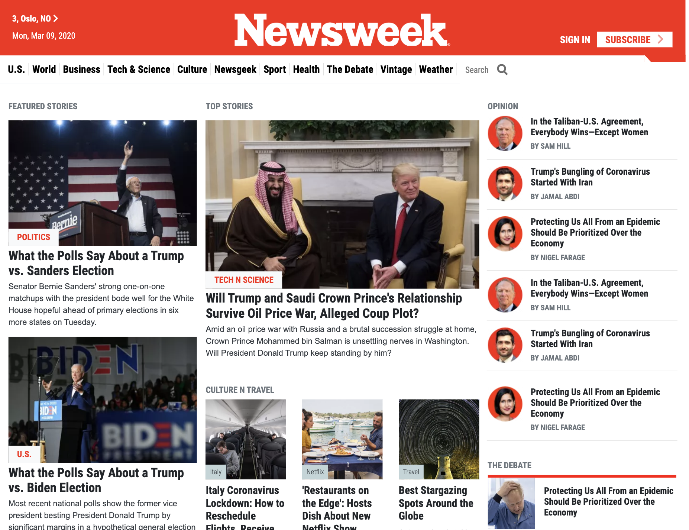

# News-Week.com Clone
In this project I have build a replica of the news site Newsweek.com using the Bootstrap framework.

## Project features:
1. Project considers responsiveness on each Bootstrap breakpoint
2. Most of the styling and position is done using Bootstrap

## Built With

- HTML, CSS3
- Bootstrap 4
- Flexbox, Grid
- Fontawesome
- Media Queries

## Screenshot

## Live Demo

https://raw.githack.com/rootDEV2990/Newsweek-Bootstrap/bootstrap/index.html

## Getting Started

Simply download the zip and decompress. Once decompressed, double click or open index.html in any web browser. 

To get a local copy up and running follow these simple example steps.

### Prerequisites

Any web browser will do, Mozilla, Safari, or Chrome. 

### Setup

None needed drecompress and drag and drop onto browser. 

### Install

None needed. 

### Usage

Microverse Curriculum. 

### Run tests

Text editor and web browser.

### Deployment

Localhost. 

👤 **Muhammad Arslan**

- Github: [@githubhandle](https://github.com/arslanbisharat)
- Twitter: [@twitterhandle](https://twitter.com/arslan_bisharat-2020bb156)
- Linkedin: [linkedin](https://www.linkedin.com/in/muhammad-arslan-2020bb156)

## 🤝 Contributing

Contributions, issues and feature requests are welcome!

Feel free to check the [issues page](issues/).

## Show your support

Give a ⭐️ if you like this project!

Bitcoin donations accepted ;)

 
## 📝 License

This project is for microverse course purposes.